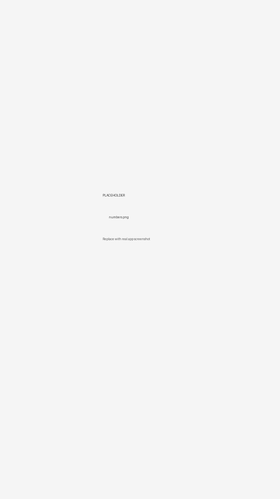

# 彩运宝（CaiYunBao）

> Android 号码随机生成、手动选号、保存与复制工具。  
> 当前项目仍处于发布/备案流程中，功能与界面以实际发布版本为准。

## 项目简介

**彩运宝**是一款面向 Android 的号码选择与管理工具，当前主要围绕双色球号码场景提供便捷的随机选号、手动添加、保存和复制能力。后续可按版本规划扩展更多号码类工具功能。

> 说明：本项目不提供彩票销售、代购、合买，不承诺中奖概率或收益，也不构成任何投资、博彩或购买建议。请遵守所在地法律法规并理性使用。

## 主要功能

- 随机选号
- 多注号码生成
- 手动添加号码
- 保存常用号码
- 一键复制号码
- 适配 Android 手机端
- 金色 + 红色东方财运视觉主题

> 实际功能请以当前发布版本为准。

## 应用截图

> 当前压缩包中的图片是**占位图**。上传 GitHub 前，请把它们替换为真实应用截图，并保持文件名不变。

### 首页


### 选号页面


### 号码保存/管理


## 下载与安装

推荐通过 GitHub **Releases** 发布 APK，而不是把大型 APK 直接长期提交到源码目录。

发布完成后，可在仓库右侧 **Releases** 中下载最新 Android 安装包。

APK 建议命名：

```text
CaiYunBao_vX.Y.Z.apk
```

例如：

```text
CaiYunBao_v0.3.3.apk
```

> 请把 `vX.Y.Z` 替换成 APK 的真实版本号，不要为了示例而使用旧版本号。

## 安装说明

1. 在 GitHub Releases 下载 APK。
2. 在 Android 手机上打开 APK。
3. 如系统提示，请仅对可信来源临时允许“安装未知应用”。
4. 安装完成后可关闭该权限。

## 版本说明

建议每次发布都使用独立版本号，例如：

```text
v0.3.3
v0.3.4
v0.4.0
```

GitHub Release 标题建议：

```text
彩运宝 vX.Y.Z
```

## 隐私与安全

在公开仓库前，请确认**不要上传**：

- Android 签名证书（`.jks` / `.keystore`）
- 签名密码
- `keystore.properties`
- `local.properties`
- 服务器密码、SSH 私钥
- API Key / Token / Secret
- 数据库账号密码
- 华为云访问密钥
- 备案材料中的个人证件或手机号
- 任何用户隐私数据

如果不确定某个文件能不能公开，建议先使用 **Private（私有）仓库**。

## 开源说明

本模板**未自动添加开源许可证**。  
如果你只是想把项目备份到 GitHub，建议先使用 Private 仓库。  
如果未来准备开放源代码，再根据需要选择合适的 LICENSE。

## 当前状态

- Android：开发/测试中
- 备案：进行中
- 应用市场发布：按审核流程推进
- GitHub：可先作为项目备份与版本发布页面使用

---

**免责声明：** 彩运宝仅提供号码随机生成、记录和管理相关工具能力，不销售彩票、不代购彩票、不保证中奖。
