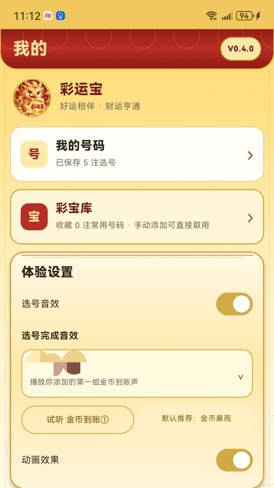

# 彩运宝 CaiYunBAO

一款面向 Android 的号码随机生成、手动选号、号码保存与管理工具。

> 当前项目仍处于备案 / 发布流程中，功能与界面以最终正式发布版本为准。

## 功能简介

彩运宝目前主要提供：

- 智能/随机选号
- 多注号码生成
- 手动添加号码
- 保存常用号码
- 复制号码
- 彩宝库号码管理
- 多种选号音效
- Android 手机端适配

后续版本可根据发布计划继续扩展更多号码类工具功能。

## 应用截图

### 首页


### 选号页面


### 彩宝库



## 安装方式

正式安装包建议通过本仓库的 **Releases** 页面下载。

APK 文件建议使用明确版本号命名，例如：

```text
CaiYunBAO_vX.Y.Z.apk
```

如当前版本属于候选发布版，也可使用：

```text
CaiYunBAO_vX.Y.Z_RC1.apk
```

请以 Releases 页面中的实际版本号为准。

## 项目状态

- 平台：Android
- 当前状态：备案 / 发布流程进行中
- 源码：已纳入 GitHub 版本管理
- APK：通过 GitHub Releases 单独发布

## 隐私与安全

公开仓库中不应包含：

- Android 签名证书（`.jks` / `.keystore`）
- 签名密码或 `keystore.properties`
- `local.properties`
- API Key、Token、Secret
- 服务器账号密码
- SSH 私钥
- 云服务访问密钥
- 数据库账号密码
- 个人备案材料或其他隐私资料

## 使用说明

彩运宝仅提供号码随机生成、记录、保存和管理等工具能力。

本项目：

- 不销售彩票
- 不提供代购或合买
- 不承诺中奖
- 不保证任何收益
- 不构成任何投资、博彩或购买建议

请遵守所在地相关法律法规并理性使用。

## 版本管理

建议每次发布使用独立版本号：

```text
v0.9.0
v0.9.1
v1.0.0
```

GitHub Release 标题建议：

```text
彩运宝 vX.Y.Z
```

## 仓库结构

```text
CaiYunBAO/
├─ app/
├─ docs/
│  └─ screenshots/
├─ gradle/
├─ .gitignore
├─ build.gradle.kts
├─ gradle.properties
├─ gradlew
├─ gradlew.bat
├─ settings.gradle.kts
└─ README.md
```

---

**CaiYunBAO / 彩运宝**
